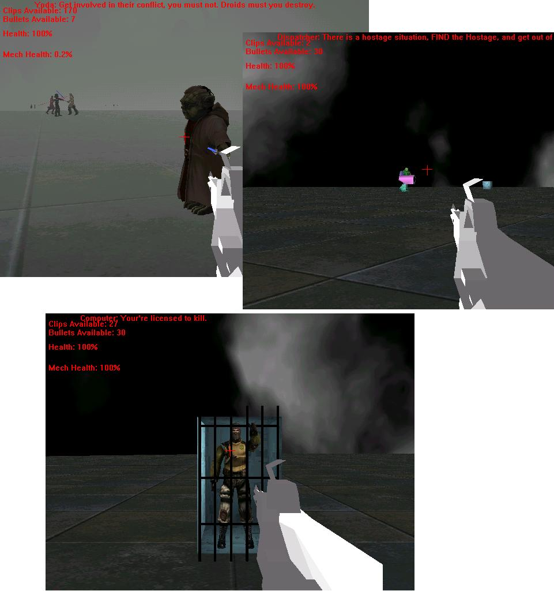



## Half\-Life/Counter\-Strike Clone\- Complete First Person Shooter

### Description

Complete first person shooter, with sound, and full animated models. You're a soldier sent into an area to free a hostage but encounter a hostage?! What!? Exactly. With four jedi knights and yoda?! Check it out. All animation are done by me except for gun and cyborg, thier credits are in the main module's declaration. Any code taken is credited in the declarations of the main module. Remeber to vote, especially since i'm a gr.10 student ;)This game is extremly fast and heavely commented. It also includes an executable as fps.exf, just change the .exf to .exe ;) Note the textures for the battle are located at: http://planetsourcecode.com/vb/scripts/ShowCode.asp?txtCodeId=54256&lngWId=1 For some reason planetsourcecode won't let me upload the entire thing with textures and source code, the file probably got too big :D
 
### More Info
 

             |
---                |---
**Submitted On**   |2004-06-08 14:22:00
**By**             |[Sunny Corp\.](https://github.com/Planet-Source-Code/PSCIndex/blob/master/ByAuthor/sunny-corp.md)
**Level**          |Intermediate
**User Rating**    |4.3 (30 globes from 7 users)
**Compatibility**  |VB 5\.0, VB 6\.0
**Category**       |[Games](https://github.com/Planet-Source-Code/PSCIndex/blob/master/ByCategory/games__1-38.md)
**World**          |[Visual Basic](https://github.com/Planet-Source-Code/PSCIndex/blob/master/ByWorld/visual-basic.md)
**Archive File**   |[Half\-Life\_175516682004\.zip](https://github.com/Planet-Source-Code/sunny-corp-half-life-counter-strike-clone-complete-first-person-shooter__1-54257/archive/master.zip)

